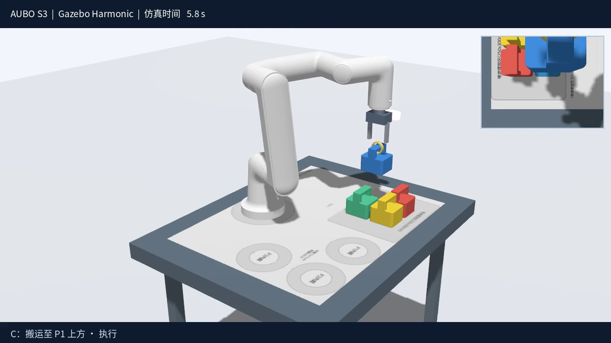
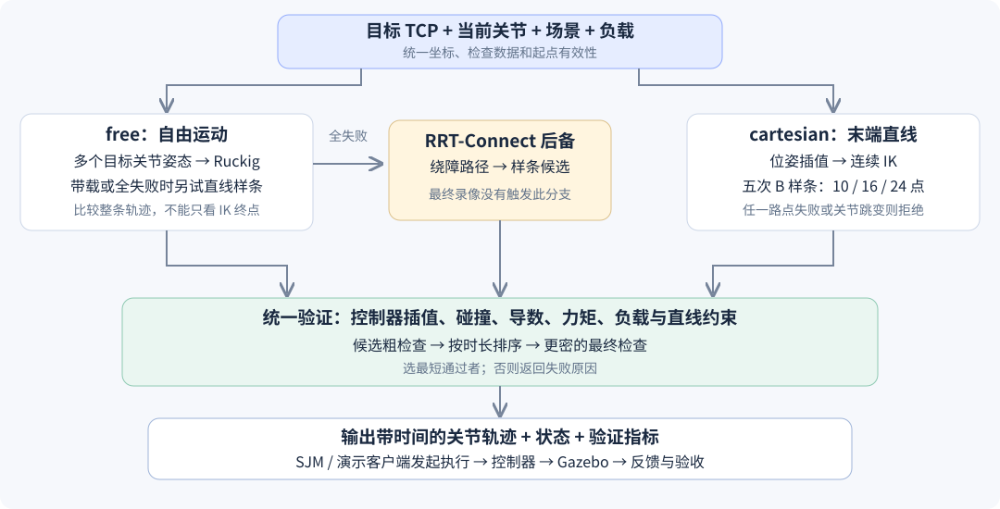
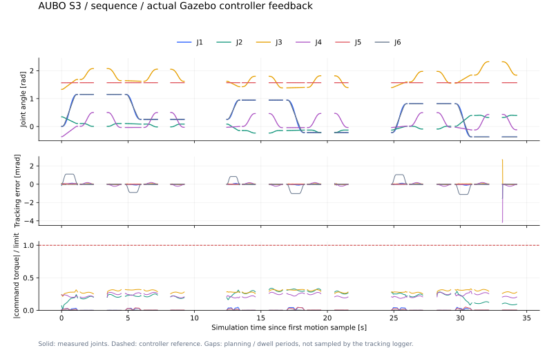
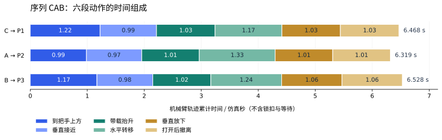

# AUBO S3 电池搬运运动规划技术报告

**面向常建烁 · 从目标位姿到可执行轨迹 · 2026 年 9 月 5 日**

本报告说明已经完成的 ROS 2 / Gazebo 工程：它解决什么问题、为什么采用这套方法、代码怎样把数学曲线变成实际运动，以及最终数据能支持哪些结论。读者不需要先学完机器人学；公式后都配有直观解释。

阅读建议：第一次先看第 1、3、4、9、10 节，理解任务、输入输出和实际结果；准备修改算法时，再读第 5～8 节；与 SJM 联调时重点看第 12 节。

## 1. 已经完成什么，常建烁负责什么 {#scope}

工程已经跑通：**读取仿真真值 → 生成目标 TCP 位姿 → 寻找可行关节姿态 → 生成与比较轨迹 → 检查碰撞和动力学 → 控制机械臂抓放电池 → 保存执行证据与视频。**

使用官方 AUBO S3 模型、腕部 RealSense D435i 模型、用户提供的电池 STEP，以及两片能够张开和闭合的半圆锁扣。场景使用原尺寸比赛底图，基础任务搬运 C 到 T0，序列任务按照示例次序 CAB 搬运到 P1、P2、P3。

两次最终运行共完成 **4 次抓放**，均通过本工程的验收，未记录非预期接触。序列流程用时 **37.544 仿真秒**，其中机械臂轨迹累计 **19.315 秒**。这说明方案在已记录的场景与参数下能够执行；只有两次场景运行，尚不能据此估计一般任务的成功率。[序列原始记录](../../data/runs/sequence_demo/summary.json) · [基础原始记录](../../data/runs/basic_demo_final/summary.json)



*图 1：来自最终序列视频的实际仿真画面。模型受控制器与物理引擎驱动，电池随锁扣搬运。观看：[序列视频](../../data/videos/sequence_demo.mp4) / [基础视频](../../data/videos/basic_demo_final.mp4)。*

### 1.1 分工如何落到工程里

| 模块 / 负责人 | 要回答的问题 | 本次工程状态 |
| --- | --- | --- |
| 感知 / 孙浩然 | 电池是什么颜色、在哪里、朝哪边？ | 已提供相机数据；规划直接使用仿真真值，未实现正式视觉算法 |
| 标定 / 韩明赫 | 相机看到的位置怎样换算到机械臂坐标？ | 本次由精确模型与 TF 给出；正式手眼标定仍待对接 |
| 任务调度与状态机 / SJM | 先搬哪块，下一步是什么，失败后怎么办？ | `demo.py` 提供集成测试流程；正式任务管理由 SJM 负责 |
| **运动规划 / 常建烁** | **从当前姿态怎样快速、避碰地达到目标？** | **本次核心实现：IK、路径与轨迹、约束验证、规划接口** |
| 操作与执行 / SJM | 什么时候闭合锁扣，如何发送和监控轨迹？ | 演示已打通控制与锁扣；正式执行层由 SJM 接入 |
| 仿真与评测 / 张叔阳牵头 | 怎样统一模型、复现、记录和验收？ | 本次配套完成 Gazebo 场景、真值、接触记录及视频 |

这里的配套实现服务于常建烁模块的完整演示，不改变团队责任分配。正式系统应保留一个任务调度入口。[团队责任表](../team/OWNERS.md)

### 1.2 本报告怎样使用“最优”这个词

本版追求的是：**在给定计算预算内，从生成的候选中，选出执行时间最短、且通过规定检查的轨迹。**

它没有证明带障碍、负载、关节限制和真实控制误差的全局最短时间解。下列三个问题也要分别衡量：算得快不快、机械臂动得快不快、整个抓放任务结束得快不快。后文分别给出数据。

## 2. 仿真里究竟放了什么 {#models}

### 2.1 软件版本与模型来源

| 组成 | 本机实际使用 | 用途 |
| --- | --- | --- |
| 操作系统 | Ubuntu 22.04.5 / WSL2 | 承载开发与仿真 |
| ROS | **ROS 2 Humble** | 消息、坐标变换、动作接口和节点运行 |
| MoveIt 2 | 2.5.9 | 机器人模型、KDL IK、规划场景与 FCL 碰撞检查 |
| Gazebo | **Harmonic，gz-sim 8.12.0** | 刚体物理、接触、相机与 IMU |
| Ruckig | 本机安装版本 0.9.2 | 有速度、加速度、jerk 限制的关节运动生成 |
| ros2_controllers | 2.53.1 源码及本工程补丁 | 关节轨迹插值、反馈控制和力矩前馈 |
| gz_ros2_control | 固定源码版本，针对 Harmonic 编译 | ROS 控制器与 Gazebo 关节之间的接口 |
| 电池 CAD 转换 | OCP 7.7.2、trimesh 4.12.2 | STEP 几何、网格及质量属性处理 |

系统中同时安装了 Fortress 6.17.1，但本次演示使用 Harmonic。早期检查发现系统控制插件链接的是 Fortress，因此在 `vendor_ws` 中单独构建匹配 Harmonic 的版本；运行时必须加载项目环境。[环境记录](../environment/README.md) · [运行前源码和二进制清单](../../data/runs/sequence_demo/source_manifest.json)

S3 的 URDF、显示网格与碰撞网格来自 [AuboRobot 官方模型仓库](https://github.com/AuboRobot/aubo_description)，下载固定到提交 `47fa5e02fa873f27f7e812d31f31e3f4cf5e56b1`。URDF 可以理解为机器人的“装配说明书”：记录连杆尺寸、关节轴、质量、惯量以及关节限制。显示模型负责外观，碰撞模型负责判断几何体是否相交。

### 2.2 原底图、世界坐标与单位

底图 PDF 页面约为 **700 × 540 mm**。工程从原始矢量图提取位置和尺度，再将原图作为台面纹理；没有为了提高可达性而缩小图纸或移动目标圈。

约定世界坐标 `world` 的 +Z 向上，机械臂底座中心位于 `[0, 0, 0.65] m`。桌面高度为 **0.65 m**；底图平面内 +X 指向 PDF 上方，+Y 指向 PDF 左方。

PDF 使用左上角为原点、向右为 u、向下为 v 的坐标。若底座中心在图纸中的位置为 `(u₀, v₀)`，则：

```text
x_world = (v₀ − v) / 1000
y_world = (u₀ − u) / 1000
z_world = 0.65              ← 这里只表示桌面上的点
```

除以 1000 是从毫米换成米。`base_link` 与世界坐标的水平轴方向一致，因此同一个点的 `z_base = z_world − 0.65`。把“桌面上的点”和“把手中心”混为一谈，会产生几十毫米的抓取高度错误。[底图测量原始数据](../competition/extracted/board_geometry.json)

| 目标中心 | 世界 X / m | 世界 Y / m | 电池底面目标 Z / m |
| --- | ---: | ---: | ---: |
| 基础 T0 | 0.299848 | −0.115038 | 0.650000 |
| 序列 P1 | 0.363942 | −0.041610 | 0.650000 |
| 序列 P2 | 0.363942 | −0.216610 | 0.650000 |
| 序列 P3 | 0.188942 | −0.216610 | 0.650000 |

原图还有一个必须保留的几何边界：序列内圈直径 **80 mm**，电池平放尺寸 **70 × 80 mm**，其矩形外接圆直径为 `√(70² + 80²) ≈ 106.30 mm`。因此电池平放不可能被 80 mm 圆完整包含。本次验收检查中心落点与稳定性，不据此宣称内圈满分。

### 2.3 STEP 电池与锁扣几何

原始 `电池道具.stp` 保留不动。模型转换后外包尺寸为 **70 × 80 × 80 mm**：主体高 50 mm，上方把手延伸到 80 mm；把手横梁中心在电池局部坐标 `[0, 0, 0.074] m`，横梁尺寸约为 **70 × 26 × 12 mm**。

原 CAD 的朝向与场景不一致，转换关系为 `x′ = 0.001x，y′ = −0.001y，z′ = 0.05 − 0.001z`。这同时完成单位转换、绕 X 轴翻转和底面归零。可视网格保留 CAD 形状；碰撞采用主体凸包、两侧立柱和横梁盒体的组合，计算更稳定，但仍属于几何近似。[电池几何与惯量文件](../../src/mtc_description/config/battery.json)

| 项目 | 本次取值 | 来源 / 含义 |
| --- | --- | --- |
| 电池质量 | 0.4 kg | 仿真假设，未提供实物称重数据 |
| 电池质心高度 | 约 29.14 mm | 按 CAD 实体、均匀密度和假设质量计算 |
| 台面接触摩擦系数 | 0.8 | 仿真假设 |
| 半圆锁扣内 / 外半径 | 15.5 / 19.5 mm | 概念夹具参数 |
| 锁扣沿把手轴向宽度 | 10 mm | 位于横梁中部，避开两侧立柱 |
| 每片锁扣张开行程 | 22 mm | 两片相向闭合，闭合关节位置为 0 |
| 腕部到 TCP 的轴向偏移 | 约 130 mm | 包含安装和夹具长度 |

把手 26 × 12 mm 截面的角点到中心距离约 14.32 mm，小于锁扣内半径 15.5 mm，所以闭合后能够从几何上包住横梁。这个尺寸关系说明概念结构可以容纳把手；材料强度、制造公差和实际受力仍需另行设计验证。

### 2.4 腕部 D435i 的作用

相机安装在 `wrist3_Link`，随腕部运动；保留官方模型内部的光学坐标关系。本次生成 **640 × 480、10 Hz 的 RGB-D**，以及 **100 Hz IMU**。RGB、浮点深度、内参和 IMU 都已通过实际订阅读取检查。[传感器验证](../../data/validation/sensors.json)

本次规划使用 Gazebo 真值，相机画面用于验证设备链路和展示腕部视角。深度是理想仿真深度，没有重现真实 D435i 的双目匹配、反光误差、噪声和空洞；仿真相机的视角参数也不能直接作为实机精度承诺。

## 3. 常建烁模块的输入和输出 {#interfaces}

### 3.1 为什么输入不能只有一个 XYZ 点

只告诉机械臂“到这里”，至少还缺四类信息：**夹具朝向、当前关节姿态、周围障碍物、手上是否提着电池**。例如，夹具中心到了把手中心，但锁扣圆环轴向旋转了 90°，仍可能无法套住横梁。

TCP（Tool Center Point，工具中心点）是人为定义的操作参考点。本工程把它放在锁扣闭合时的圆环中心。目标位姿是“这个点到哪里、工具朝哪边”，不是腕部法兰中心到哪里。

| 输入 | 通俗解释 | 本次来源 |
| --- | --- | --- |
| 当前六关节位置 | 六个电机现在分别转到了哪里 | `/joint_states`；演示在静止后开始各段 |
| 目标 TCP 位姿 | 工具中心位置 + 朝向 + 坐标系 | 从电池真值与把手几何计算 |
| 障碍场景 | 桌面、地面、其他电池以及机器人自身形状 | 配置文件 + Gazebo 真值 |
| 锁扣 / 负载状态 | 电池是桌上障碍，还是随手运动的负载 | `/simulation/latch_state` |
| 运动模式 | 可以自由绕行，还是必须近似走直线 | SJM 的任务请求 / 演示流程 |
| 运动限制与预算 | 允许多快、多大的加速度、计算多久 | 模型、配置和请求参数 |

ROS action 地址为 `/motion_planning/plan`。`free` 用于自由搬运，`cartesian` 用于末端直线接近、升降和撤离，`joint` 用于直接指定关节目标。`start_state` 留空时读取最新关节状态；目标坐标系支持 `world` 或 `base_link`。[实际 action 定义](../../src/mtc_interfaces/action/PlanMotion.action)

### 3.2 输出主要是轨迹，IK 是其中的一环

对外最重要的输出是 `RobotTrajectory`，其中 `joint_trajectory` 指定六个关节在不同时间应该处于的状态：

```text
每一个轨迹点 = {
    time_from_start,        从本段运动开始经过多少秒
    positions[6],           六个关节角 q，单位 rad
    velocities[6],          六个关节速度，单位 rad/s
    accelerations[6],       六个关节加速度，单位 rad/s²
    effort[6]               本工程计算的力矩前馈，单位 N·m
}
```

IK 的末端解通常体现在轨迹最后一点的 `positions` 中。执行层不需要再发送一条独立的“IK 命令”；它需要的是从当前状态到终点的一整段带时间轨迹。

`rad` 是弧度，1 rad 约为 57.3°；公式里的 `q̇` 表示关节速度，`q̈` 表示关节加速度，`τ` 表示力矩。力矩可以理解为电机“拧动关节的劲”，与直线方向的力不是同一个量。

结果还包括 `success/reason`、规划墙钟耗时、轨迹预计时长、预测力矩比例、最小非豁免间距和候选诊断。执行层必须先检查 `success`，再发送轨迹并检查控制器反馈。IK 可达、规划成功、控制执行成功和电池放稳是不同层级的结果。

## 4. 从零理解 IK、路径和轨迹 {#basics}

### 4.1 正运动学和逆运动学

把六个关节角写成 `q = [q₁, …, q₆]`，机器人几何关系就能算出 TCP 的位置和朝向，记为 `T = FK(q)`。这叫**正运动学**：已知身体怎么摆，求手在哪里。

**IK（Inverse Kinematics，逆运动学）**反过来：已知希望手在哪里、朝哪边，求六个关节怎么摆。类比伸手拿杯子，同一个手的位置，可以用不同的肘部姿势实现。机械臂的不同逆解，会影响绕行、关节行程、碰撞和运动时间。

本工程使用 KDL 数值 IK：从一个猜测姿态开始，迭代减少末端误差。为了避免只拿到一个不好的姿态，外层改变初值，寻找多个不同的有效解。KDL 的求解器及关节限制配置可参阅 [MoveIt KDL 说明](https://moveit.picknik.ai/humble/doc/examples/kinematics_configuration/kinematics_configuration_tutorial.html)。

“没找到解”不一定等于数学上绝对无解；也可能是在当前求解器、初值、碰撞条件和计算预算内没有找到。接口返回原因，便于上层决定换抓取姿态或结束任务。

### 4.2 路径与轨迹差在哪里

| 环节 | 它解决的问题 | 可以怎样理解 |
| --- | --- | --- |
| IK | 终点对应哪些关节姿态？ | 先决定到达时身体怎么摆 |
| 路径规划 | 从起点到终点，中间经过哪些姿态？ | 在地图上画路线，还没安排速度 |
| 路径优化 | 是否绕远、急转或经过不利姿态？ | 调整路线形状 |
| 时间分配 | 每一段什么时候走、多快走？ | 给路线排时刻表 |
| 平滑与执行验证 | 控制器插值后是否仍符合要求？ | 检查发送到电机的实际参考指令 |

路径可以写作 `q(s)，0 ≤ s ≤ 1`，s 只表示完成进度。轨迹是 `q(t)`，t 是有单位的秒。同一条路径，1 秒走完和 5 秒走完，在动力学上完全不同。

机械臂还要区分两个空间：**关节空间**是六个关节角组成的空间，**工作空间**是桌面、夹具和电池所在的三维世界。关节角直线插值不等于 TCP 走直线；TCP 没碰东西，也不等于肘部或相机没有碰东西。

### 4.3 多项式、B 样条属于哪个环节

它们首先是**曲线的表达方式**，并非天然属于某一个步骤。把多项式写成 `q(s)`，它表达路径；写成 `q(t)`，就表达轨迹。优化其系数或控制点可以改变路线；调整时间可以改变速度。控制器也会使用多项式连接相邻采样点。

本工程有两个明确用途：用**五次 B 样条**拟合某些候选轨迹，用**五次多项式插值**连接交给控制器的相邻状态点。“B 样条”与“控制器插值”是两个层次，后者并不知道前者的控制点。

### 4.4 你做过的无人机轨迹优化，哪些经验可以迁移

| 对比项 | 无人机中常见的处理 | 本工程的机械臂问题 |
| --- | --- | --- |
| 优化变量 | 位置、航向、时间及其曲线参数 | 六关节轨迹，或末端路径加连续 IK |
| 曲线表达 | 分段多项式、B 样条 | 同样适用，导数和时间缩放的数学一致 |
| 避障对象 | 机体包络与飞行环境 | 每根连杆、腕部相机、夹具及所持电池 |
| 动力来源 | 推力与机体姿态耦合 | 多关节力矩、惯量耦合与重力 |
| 几何难点 | 飞行通道、姿态和机体空间 | 多逆解、自碰撞、关节范围及奇异位形 |
| 接触 | 自由飞行段通常避免接触 | 抓取和放置必须发生受控接触 |

可直接迁移的经验包括：限制高阶导数、设计边界条件、优化时间、使用碰撞裕量和区分规划与反馈控制。需要新补的知识主要是 FK/IK、雅可比矩阵、全身碰撞和机械臂动力学。

雅可比矩阵 `J(q)` 可以理解为“关节小幅转动如何变成末端小幅移动”的换算表：`末端速度 = J(q) × 关节速度`。接近奇异位形时，某些末端运动可能需要很大的关节变化。当前工程通过 IK 连续性、关节跳变和导数约束拦截部分不利运动，尚未加入专门的可操作度优化目标。

## 5. 本工程选择轨迹的完整方法 {#planner}

### 5.1 目标是带条件的短时间运动

理想的数学目标可以概括为：

```text
使运动时间 T 尽量小
同时满足：
  起点正确，终点 TCP 达到目标位姿
  关节位置、速度、加速度、jerk 不超过限制
  机器人、自身附件和负载没有禁止的碰撞
  需要直线运动的阶段满足末端直线与姿态要求
  电池倾斜与桌面关系符合当前阶段约束
  预测驱动力矩和控制器插值通过检查
```

这些约束使问题成为复杂的非线性搜索。当前实现用“多候选生成 → 约束筛选 → 比较时长”，获得一个可解释、可验证的工程解；没有把上述全部约束交给一个联合非线性优化器求解。



*图 2：自由运动与直线运动使用不同候选生成方式，最终通过同一套验证再对外输出。执行由演示客户端或 SJM 的正式执行层发起。*

### 5.2 自由运动：先比较逆解，再比较整条运动

1. 读取当前状态、物体真值和锁扣状态，创建本次规划场景；关节或真值数据超过 2 秒墙钟未更新时拒绝规划。
2. KDL 外层最多尝试 24 个初值，保留最多 6 个不同、满足终点碰撞检查的关节解；计算预算也会限制搜索。
3. 对每个关节目标生成 Ruckig 直接运动候选，检查整条运动。末端 IK 有效不代表这一段直接运动有效。
4. 有负载时，或直接候选全部失败时，再尝试末端直线路径及 10 / 16 控制点的五次 B 样条候选。
5. 若仍无候选通过，调用 OMPL 的 RRT-Connect 搜索绕障路线，再尝试 12 / 20 / 32 控制点的样条拟合。
6. 按时长排序，对候选逐条进行更密的最终检查，输出第一条通过者。

RRT-Connect 可以理解为从起点和终点分别“长出”搜索树，尝试在无碰撞空间中连接；它负责找到几何通路，之后仍需要平滑、分配时间和重新检查。[OMPL 原始实现说明](https://ompl.kavrakilab.org/classompl_1_1geometric_1_1RRTConnect.html)

本次最终录像中的自由动作已有可行直接候选，**没有触发 RRT-Connect 后备**。代码接入与场景验证覆盖是两件事；不能把这两段录像当作复杂迷宫避障的性能证明。

### 5.3 接近与升降：先保证末端的运动方式

`cartesian` 模式先在 TCP 起终点之间插值位置与朝向，平移分段约 4 mm，旋转分段约 0.02 rad。每一个中间位姿都用前一个关节解作为 IK 初值，尽量保持同一条运动分支。

任一中间点不可行，就拒绝该直线动作；相邻点单关节跳变超过 0.22 rad 也拒绝。随后比较 10 / 16 / 24 控制点的五次 B 样条。样条会改变经过点之间的形状，因此还要重新检查末端直线偏差，而不能仅检查拟合前的路点。

当前规划曲线的直线偏差门槛为 **1.5 mm**，姿态偏差门槛为 **0.018 rad**。这属于规划参考的约束；物理执行后的 TCP 误差另行测量。[规划器实际代码](../../src/mtc_motion_planning/src/planner.cpp)

### 5.4 为什么采用这套组合

比赛场景小、位置已知，接近和释放具有明确的方向要求。自由转移优先尝试直接关节运动，能减少不必要的搜索；关键操作使用笛卡尔直线，更容易理解和验收；多个 IK 与多种样条候选提供比较空间；统一碰撞、动力学和插值检查保证各候选使用同一把尺子。

代价是候选集合有限，逐段静止会增加启停，且多次验证有计算成本。本版的优势是形成了可复现的完整执行链路；它尚未与其他规划器做足够广泛的同条件对照，不能据此认定某种算法普遍最快。

## 6. B 样条、Ruckig 与时间分配如何工作 {#trajectory}

### 6.1 先理解一个单关节五次多项式

假设某关节从 0 转到 1 rad，希望起点和终点的速度、加速度都为 0。令 `u = t/T`，可取：

```text
q(t) = 10u³ − 15u⁴ + 6u⁵，  u = t/T
```

它用六个系数满足两端的位置、速度和加速度共六个条件。“五次”描述多项式的最高次数，并不意味着有五个动作阶段；这个式子也不自动保证避障或时间最优。

### 6.2 五次 B 样条：用多个控制点共同塑造曲线

B 样条可以写成 `q(u) = Σ Pᵢ Nᵢ,₅(u)`。`Pᵢ` 是六维关节控制点，`Nᵢ,₅` 是五次基函数。可以把基函数看成不同位置的“影响权重”：移动一个控制点主要改变局部曲线，曲线通常不逐一穿过控制点。

本工程将路径按关节空间弧长安排进度，用五次缓启缓停函数分配拟合位置，再解线性方程得到内部控制点。首尾各三个控制点分别设为起终点，以构造两端零速度、零加速度。之后根据导数控制点的界，选择满足速度、加速度与 jerk 的时长。

这属于**样条拟合、若干控制点数量比较和时间缩放**。当前没有连续优化所有控制点和障碍距离，也没有实现完整的 TrajOpt 或全局样条最优求解。增加控制点有时更贴近路径，也可能增加曲率或检查成本，不能简单认为“点越多越好”。[轨迹内核](../../src/mtc_motion_planning/include/mtc_motion_planning/trajectory.hpp)

### 6.3 Ruckig：直接安排受约束的关节快慢

Ruckig 接收各关节的起终状态和速度、加速度、jerk 限制，生成同步运动。jerk 是加速度的变化率；限制它，相当于避免电机突然从“轻推”变成“猛推”。常见结果呈 S 形速度变化。

Ruckig 官方对其状态到状态问题说明了时间最优性质，但这是在其定义的运动状态和限制范围内；它本身不理解本工程的桌面、锁扣、电池倾斜及完整驱动力矩约束。这里还会进行额外筛选和必要的延时处理。[Ruckig 官方说明](https://docs.ruckig.com/)

当前调用以静止起点和静止终点为主。本机使用 0.9.2，在线文档会随项目更新；本工程行为以固定代码与测试为准，不能把在线新版的全部功能视为本机已经实现。

### 6.4 为什么时间缩短一点，控制压力会明显增加

保持同一路径，把时间缩为原来的 k 倍：速度变成 `1/k` 倍，加速度变成 `1/k²` 倍，jerk 变成 `1/k³` 倍。例如 T 从 2 秒压到 1 秒，三者分别增加为 **2、4、8 倍**。

<!-- TIME_SCALING_DEMO -->

因此“尽量快”不是不断调高一个速度滑块。当前样条先由导数界估计可行时间，再检查动力学与控制器插值；不满足时延长时间，或直接淘汰候选。缓慢运动也可能因为重力或几何原因不可行，并非所有问题都能靠放慢解决。

### 6.5 TOTG、TOPPRA 在哪里，为什么本版没有全部串起来

| 方法 | 核心问题 | 本版状态 |
| --- | --- | --- |
| 本工程 Ruckig 直接候选 | 已知关节起终状态，安排同步且受 jerk 限制的运动 | 已使用 |
| 本工程五次 B 样条 | 将候选路径表达为平滑曲线，再设置时长 | 已使用 |
| TOTG | 为几何路径安排时间；可能在容差内调整路径 | 背景比较方案，未用于本次输出 |
| TOPPRA | 给定路径和约束，求路径进度的时间参数化 | 背景比较方案，未用于本次输出 |

不同工具不是必须全部叠加的流水线。MoveIt 文档提醒 TOTG 可能改变路径，需要额外碰撞检查，并介绍了后接 Ruckig 平滑的用法；TOPPRA 则提供另一类固定路径时间参数化框架。后续应在同一场景与同一验收标准下比较收益，而不是仅增加算法名称。[MoveIt 时间参数化说明](https://moveit.picknik.ai/humble/doc/examples/time_parameterization/time_parameterization_tutorial.html) · [TOPPRA 项目文档](https://hungpham2511.github.io/toppra/)

## 7. 怎样让规划更好地支持控制 {#control}

### 7.1 电机能否做到：速度限制以外还要看力矩

| 关节组 | 速度上限 rad/s | 加速度上限 rad/s² | jerk 上限 rad/s³ | URDF 力矩限值 N·m |
| --- | ---: | ---: | ---: | --- |
| 肩、上臂、前臂 | 2.3 | 4 | 28 | 49、49、39 |
| 腕 1、腕 2、腕 3 | 2.8 | 6 | 45 | 9.8、9.8、9.8 |

速度在官方 URDF 限制以内；加速度和 jerk 是当前仿真调试取值，不能当作厂家认证上限。各阶段还可通过请求比例减速。[关节配置](../../src/mtc_motion_planning/config/joint_limits.yaml)

动力学计算回答“沿这条轨迹运动，此时每个电机需要多大的力”。常见形式为：

```text
τ = M(q) q̈ + C(q, q̇) q̇ + g(q)
    加速所需力矩    运动耦合项      抵抗重力
```

本工程用 Newton–Euler 递推计算：先沿机械臂向外算各连杆的运动，再从末端向内汇总力与力矩。相机偏置、夹具、两片锁扣以及抓住后的电池都影响结果。相同的关节角度，有没有提着电池，需要的力矩不同。

候选粗检查要求预测力矩比例不超过 **0.82**；超出时尝试把时间乘以 1.15，有限次重试。更密的最终检查采用 **0.84** 门槛，以容纳粗细采样差异。这里保留了一定余量，但没有把模型误差严格量化成鲁棒性保证。[动力学代码](../../src/mtc_motion_planning/include/mtc_motion_planning/dynamics.hpp)

### 7.2 前馈先提供合适的力，反馈再纠正偏差

规划器发送位置、速度、加速度和预测力矩前馈。控制器比较“应该在哪里”和“实际在哪里”，补上纠偏力矩。本次积分增益为 0，因此可近似理解为：

```text
力矩指令 = 动力学前馈 + Kp × 位置误差 + Kd × 速度误差
```

前馈好比提前知道要托住多重的物体，先给出大致合适的力；反馈负责修正模型与实际响应的差异。Gazebo 硬件接口还按 URDF 力矩限值截断指令。控制器更新频率为 **500 Hz**，物理引擎步长为 **1 ms**。[控制器配置](../../src/mtc_motion_planning/config/controllers.yaml)

本工程记录的 effort 比例是**控制器输出命令 / URDF 限值**，不是实物电机传感器测得的力矩。它也不是“剩余载荷百分比”：剩余力矩裕量不能直接换算成还能搬多少公斤。

### 7.3 为什么控制器插值必须单独验证

控制器收到的不是无限多点的连续函数，而是有限个状态点。默认样条插值时，只有位置通常使用线性插值；给位置和速度使用三次插值；再给加速度则使用五次插值。数据不一致时，中间可能出现过冲。[ros2_control 轨迹表示说明](https://control.ros.org/humble/doc/ros2_controllers/joint_trajectory_controller/doc/trajectory.html)

本版输出完整的 q、速度和加速度。安装的 Humble JTC 2.53.1 原先拒绝轨迹中的 effort，因此在独立 overlay 中加入有限值校验、线性力矩前馈插值和 PID 叠加。位置、速度、加速度的原有插值机制保留。若省略 `source scripts/env.sh`，就可能加载不带补丁的控制器。[前馈补丁](../../scripts/jtc_effort_feedforward.patch) · [力矩限幅补丁](../../scripts/gz_effort_limits.patch)

联调还发现了一个容易被忽视的问题：不同关节的 Ruckig 阶段切换时间可能只差微秒。若把这些近邻时间全部发送给控制器，五次插值计算要除以很小的时间间隔的三次方；极小的位置浮点舍入误差，也可能被放大为很大的 jerk。

解决分为两步：先合并小于 **0.5 ms** 的相邻时间点，保留有意义的切换及端点；再对控制器实际使用的五次插值重新计算导数界。速度使用 Bernstein 形式的保守界，jerk 与加速度通过多项式极值检查；必要时延长轨迹时间并重新采样。仅仅删去密集点并不能保证合格。

最终使用实际安装的 JTC 插值器检查 **40,875 个点**，最大位置表示误差为 **1.87 × 10⁻⁸ rad**；另有 **1,000 组短动作**检查，记录中没有被判定超限的样本。它们是数值实现验证，不是机械臂跟踪精度测试。[JTC 检查结果](../../data/validation/controller_interpolation.json) · [短动作结果](../../data/validation/short_moves.txt)

## 8. 避碰、负载和锁扣如何配合 {#collision}

### 8.1 检查的是整台机械臂，不只是末端一点

每次规划都建立包含机器人、附件、桌面、地面和电池的场景。FCL 检查机器人与环境、机器人自身，以及所持电池之间的禁止相交。主要连杆或锁扣碰撞网格缺失时，程序启动失败，避免模型“看得见却不参与碰撞检查”。

候选阶段按约 14 ms 检查；最终阶段最大步长 **4 ms**，并根据速度缩短检查间隔，目标单步关节增量约 **0.003 rad**。这是有限分辨率的离散验证，不是对所有连续时刻的形式化无碰撞证明。

电池被锁住后，规划场景将它从世界中的独立障碍物转换成 TCP 的附着物，同时加入质量和惯量。搬运时检查电池倾斜，门槛为 **0.35 rad，约 20°**。直线抬升、下放时只开放必要的电池与桌面接触，并用底部角点高度防止明显穿桌。

### 8.2 有些接触是任务所必需的

电池放在桌上必须接触桌面，锁扣包住把手也需要接触。因此验收目标是“没有非预期接触”，不是“全场没有任何接触”。

规划端通过允许碰撞矩阵开放指定指片与目标电池的接触；这类豁免是按物体设置的，并不精确区分该电池的每个子零件。物理监测进一步区分把手接触和主体接触，锁扣碰到电池主体会作为非预期接触记录。两层检查的粒度不同，不能把最小非豁免距离当作锁扣内部的实际间隙。

Gazebo 插件在**每个 1 ms 物理步**收集接触，再按接触对汇总：首次 / 最后时间、出现步数、最大穿透深度及类别。最终两次运行都有监测记录，非预期接触对为 0。日志仍包含正常的桌面支撑与把手接触；接触求解中的微小穿透量也如实保留。[序列接触日志](../../data/runs/sequence_demo/contacts.json)

### 8.3 锁扣怎样建立与解除连接

两片半圆结构先按关节轨迹闭合，再请求连接电池。插件仅在以下条件成立时建立固定约束：两片均处于闭合附近、TCP 距把手横梁中心不超过 **2.5 mm**、圆环轴向与把手轴向匹配。

连接保持闭合瞬间的实际相对位姿，没有把电池瞬移到理想抓取点。释放时删除约束，再张开锁扣；电池随后由重力和桌面接触决定运动。此方法模拟包围式机械锁扣锁住后的刚性约束，**没有验证材料强度、卡扣弹性、冲击或真实摩擦承载能力**。[Gazebo 插件](../../src/mtc_simulation/src/simulation_system.cpp)

### 8.4 一次抓放为何分成六段机械臂运动

| 顺序 | 机械臂动作 | 锁扣 / 负载状态 | 原因 |
| --- | --- | --- | --- |
| 1 | 自由运动到把手上方约 110 mm | 张开、空载 | 留出垂直接近空间 |
| 2 | 沿直线下降到把手中心 | 到位后闭合并连接 | 减少横向扫碰 |
| 3 | 垂直抬升约 120 mm | 已连接、带载 | 先脱离台面和邻近电池 |
| 4 | 自由搬运到目标上方 | 带载，限制倾斜 | 在安全高度完成主要水平转移 |
| 5 | 垂直下放到目标 | 带载，到位后释放并张开 | 减少落地横向滑动 |
| 6 | 垂直向上撤离约 120 mm | 空载、张开 | 避免打开后带倒或勾住把手 |

基础任务抬升后保持 **2 秒仿真时间**；每次释放和撤离后等待 **3 秒仿真时间**，检查落点、漂移和是否直立。落点计算使用闭合时实际捕获的电池相对 TCP 变换，避免假设“每次夹住的位置绝对一致”。

## 9. 用一次真实规划串起所有概念 {#worked-example}

取最终序列的第一段“C：到达把手上方”。电池 C 的横梁中心世界高度约为 0.724 m，预接近点再向上加 0.110 m，因此目标 TCP 位置约为：

```text
世界位置 / m = [0.257832, 0.252659, 0.833999]
朝向四元数   ≈ [0.707107, 0.707107, 0, 0]，按 x、y、z、w 顺序
模式         = free
初始关节状态 = 读取最新 /joint_states
```

这个近似朝向使工具向下，并使圆环轴向沿把手横梁。实发请求保留了从真值取得的细微旋转，而不是把上述舍入值硬编码到每个场景。

<!-- BEGIN EXAMPLE_TABLE -->

| 候选 | IK 终点 | 轨迹生成 | 候选时长 / 仿真秒 | 粗检查 |
| --- | --- | --- | --- | --- |
| 1 | 有效姿态 1 | Ruckig | 1.224659 | 通过 |
| 2 | 有效姿态 2 | Ruckig | 2.029654 | 通过 |

<!-- END EXAMPLE_TABLE -->

两条候选都能到达目标且通过候选检查，但第一条运动时间更短。这个比较说明“先找到任意一个 IK 解就不再比较”可能错过更快的姿态；它不是与某个行业基准算法的平均性能对照。

选中结果的末端关节角约为：

```text
[1.151096, 0.106752, 1.685544, 0.007997, 1.570796, 1.151096] rad
```

规划墙钟耗时 **1.534 秒**，预计执行 **1.225 仿真秒**。最终更密检查使用 **497 个状态采样**，预测最大力矩比例约 **31.49%**。对外发送的不只是上述终点，还包含沿途所有轨迹状态与时间戳。[完整请求、输出轨迹与诊断](../../data/runs/sequence_demo/plan_01.json)

再看序列中 C 的带载转移：有一条约 2.138 秒的直接候选因为 `PAYLOAD_TILT` 被淘汰。其他候选即使终点正确、速度合规，也必须满足电池在途中不能过度倾斜的要求。[该段原始结果](../../data/runs/sequence_demo/plan_04.json)

## 10. 最终实测结果与正确读法 {#results}

以下只引用最终 `sequence_demo` 和 `basic_demo_final`，不混入早期调试运行。数据表由报告构建脚本从原始 JSON 生成。

### 10.1 时间、跟踪与控制命令

<!-- BEGIN METRICS_TABLE -->

| 指标 | 序列 CAB → P1 / P2 / P3 | 基础 C → T0 |
| --- | --- | --- |
| 完成抓放 / 机械臂轨迹段数 | 3 / 18 | 1 / 6 |
| 完整流程 / 仿真秒 | 37.544 | 14.612 |
| 机械臂纯运动 / 仿真秒 | 19.315 | 6.504 |
| 规划计算累计 / 墙钟秒 | 22.671 | 7.441 |
| demo 记录耗时 / 墙钟秒 | 409.406 | 161.320 |
| 最大关节跟踪误差 / rad | 0.00416983 | 0.00416904 |
| 最大关节跟踪误差 / ° | 0.238914 | 0.238868 |
| 关节跟踪 RMS / rad | 0.000221533 | 0.000273672 |
| 记录的控制反馈样本数 | 1813 | 624 |
| 最大输出力矩命令 / URDF 限值 | 33.932% | 32.288% |
| 非预期接触对数 | 0 | 0 |

<!-- END METRICS_TABLE -->

最大跟踪误差取所有已记录关节和时刻中最大的绝对偏差；RMS（均方根）则把这些误差先平方、取平均再开方，用来概括整个记录区间的偏差水平。RMS 小，仍可能存在短暂的较大峰值，因此两者一起报告。

**四种“时间”不能相加混用。** 纯运动时长是各关节轨迹时长之和；完整流程还包含锁扣动作、规划期间仿真推进和规定等待；规划墙钟时间是算法在本机消耗的实际秒数；demo 墙钟时间是该程序记录的实际运行耗时，并不等于完整系统启动到退出的全部时间。

序列的 37.544 仿真秒在本机约花费 409.406 墙钟秒，说明这次物理与渲染仿真没有达到实时推进。视频按传感器仿真时间编码，序列为 **38.36 秒 / 959 帧**，基础为 **15.44 秒 / 386 帧**，均为 25 fps、1280 × 720。录像覆盖区间包含流程边缘画面，所以略长于 demo 任务计时；两段最终录像补持帧数均为 0。[序列录像元数据](../../data/videos/sequence_demo.json) · [基础录像元数据](../../data/videos/basic_demo_final.json)



*图 3：上图实线为实际关节角，虚线为控制参考；中图是关节跟踪误差，mrad 表示千分之一弧度；下图是控制器输出力矩命令比例。横轴以首次运动记录为起点，空白是该记录器未采样的规划或等待阶段。它不是理想轨迹替代真实反馈的示意图。*

### 10.2 落点与稳定性

<!-- BEGIN PLACEMENTS_TABLE -->

| 场景 | 电池 | 目标 | XY 误差 / mm | 3 秒漂移 / mm |
| --- | --- | --- | --- | --- |
| 序列 | C | P1_inner | 0.01772 | 0.00000 |
| 序列 | A | P2_inner | 0.01006 | 0.00000 |
| 序列 | B | P3_inner | 0.04505 | 0.00000 |
| 基础 | C | T0 | 0.01244 | 0.00000 |

<!-- END PLACEMENTS_TABLE -->

落点误差为电池底面中心实际 XY 与目标 XY 的欧氏距离：`√[(x实际−x目标)² + (y实际−y目标)²]`。验收阈值为 **5 mm**，静置漂移阈值为 **2 mm**，直立要求为电池竖直轴与世界竖直轴夹角的余弦大于 0.995。

极小的误差是在理想输入、刚性锁扣、确定模型与接触条件下测得的。3 秒漂移记录为 0 表示所采集的两端状态没有变化，不表示真实夹具具有“零误差”。这些数值不能作为 S3 实机重复定位精度或视觉抓取精度。

基础任务还检查了抬升保持：命令保持时长 **2.000 仿真秒**，保持期间电池底面最低高出台面约 **120.014 mm**，位置最大变化约 **0.008 mm**。[基础真值分析](../../data/runs/basic_demo_final/figures/checks.json)

### 10.3 三种不同的误差

| 误差 | 比较对象 | 序列结果 / 意义 |
| --- | --- | --- |
| 控制器表示误差 | 规划连续函数 vs. 控制器重建曲线 | 验证数字传输和插值是否改变参考；独立 JTC 测试最大约 1.87×10⁻⁸ rad |
| 关节跟踪误差 | 控制器参考角度 vs. Gazebo 实际角度 | 序列最大约 0.00417 rad；包含物理响应与动作交接影响 |
| 电池最终落点误差 | 目标电池中心 vs. 放稳后的电池中心 | 序列最大约 0.04505 mm；是任务级最终结果 |

此外，还从 Gazebo TCP 真值统计了笛卡尔阶段的实际直线偏差，序列最大约 **1.060 mm**。分析线段从该阶段第一个实际 TCP 样本连到请求终点；下放阶段标签可能延续到短暂停留 / 释放交接。因此该值是已记录过程的采样指标，不能等同于末点误差、规划拟合误差或最终落点误差。[序列真值与跟踪复算](../../data/runs/sequence_demo/figures/checks.json)

### 10.4 每个动作花了多久



*图 4：每条横条代表一个电池的轨迹累计时长；相同颜色表示相同动作。此图只统计机械臂运动，不包括锁扣和等待。*

<!-- BEGIN PHASES_TABLE -->

| 动作 | C / 仿真秒 | A / 仿真秒 | B / 仿真秒 |
| --- | --- | --- | --- |
| 1. 到把手上方 | 1.225 | 0.986 | 1.170 |
| 2. 垂直接近把手 | 0.990 | 0.970 | 0.980 |
| 3. 带载垂直抬升 | 1.028 | 1.009 | 1.018 |
| 4. 搬运到目标上方 | 1.172 | 1.332 | 1.243 |
| 5. 垂直放下 | 1.026 | 1.010 | 1.059 |
| 6. 打开后垂直撤离 | 1.027 | 1.012 | 1.059 |
| 纯运动合计 | 6.468 | 6.319 | 6.528 |

<!-- END PHASES_TABLE -->

序列共评估 **62 条候选**：56 条通过候选粗检查，5 条因电池倾斜被拒绝，1 条因电池 B 与上臂碰撞被拒绝。18 条最终轨迹中，Ruckig 直接运动 6 条，16 控制点样条 10 条，10 控制点样条 2 条。这里的 56 条是候选粗检查通过数，不能说所有 56 条都做过最终密检查或都实际执行过。

基础共评估 20 条候选，17 条通过候选粗检查，2 条倾斜失败，1 条电池与上臂碰撞失败。被拒绝的候选没有执行；实际运行的非预期接触为 0，与候选搜索中主动发现碰撞并不矛盾。

## 11. 怎样验证，以及制作中解决了什么 {#validation}

### 11.1 从公式到完整任务的验证链

| 验证层级 | 已做的检查 | 能证明什么 / 不能替代什么 |
| --- | --- | --- |
| 轨迹数学 | 样条导数、Ruckig、插值一致性与短动作检查 | 检查公式和数值实现；不替代物理执行 |
| 实际控制器 | 40,875 个插值点，位置表示误差最大约 1.87×10⁻⁸ rad | 检查安装版本的插值与 effort 行为；不等于电机误差 |
| 动力学交叉验证 | 64 组空载 / 带载静动态状态，与 PyBullet 比较 | 最大力矩差约 2.41×10⁻¹² N·m；两者使用相同 URDF 惯量，不验证实物质量真伪 |
| 传感器链路 | RGB、32FC1 深度、内参、IMU 实际订阅 | 设备数据确实输出；不等于视觉算法完成 |
| 接口与拒绝行为 | 两场景各 7 项，通过可达目标及无效输入检查 | 检查正常规划和拒绝路径；不等于实机碰撞急停测试 |
| 完整抓放 | 2 个场景、4 次搬运、关节反馈、真值与接触检查 | 验证记录条件下闭环执行；没有统计泛化成功率 |
| 可交付成果 | MP4 完整解码、帧数一致、网页可播放 | 录像与数据可阅读、可追溯 |

7 类接口检查分别为：有效近邻目标、不可达目标、无效四元数、未知坐标系、起点关节越界、起点碰撞、锁扣张开时请求连接。最终接口验证未执行任何被拒绝的轨迹。[验收总索引](../../data/validation/final_acceptance.json) · [序列接口检查](../../data/runs/sequence_demo/rejections.json) · [动力学独立比较](../../data/validation/dynamics.json)

### 11.2 关键调试问题及其技术意义

| 遇到的问题 | 处理方式 | 需要记住的原理 |
| --- | --- | --- |
| 控制插件与 Gazebo 主版本不一致 | 单独构建 Harmonic 控制 overlay | 软件包“已安装”不代表动态库 ABI 匹配 |
| 模型显示正常，碰撞网格却未正确加载 | 修正资源路径并增加缺失模型启动检查 | 可视化和碰撞场景必须分别核对 |
| 腕部关节出现振荡 | 调整反馈增益并用真实反馈曲线复核 | 更大的 D 增益不一定更稳定，离散步长与模型也有影响 |
| JTC 拒绝 effort 字段 | 增加前馈支持并使用实际控制器测试 | 消息有该字段，不代表当前控制器版本支持其含义 |
| 极短插值间隔放大 jerk | 合并时间点，再约束实际插值曲线 | 数学上光滑，还必须数值稳定且可正确传输 |
| 底图纹理映射与录像中文字体异常 | 修正纹理方式、采用带许可的中英文字体 | 展示材料必须与场景尺寸及实际运行同步 |

完整过程保留在[制作记录网页](../progress/index.html)。早期运行目录保留调试证据，最终结论只使用本报告明确链接的两个运行编号。

## 12. 文件结构、复现与 SJM 对接 {#reproduce}

### 12.1 按职责找文件

```text
meituan_challenge/
├── src/
│   ├── mtc_interfaces/          规划 action、锁扣 service
│   ├── mtc_motion_planning/     常建烁的核心实现
│   │   ├── src/planner.cpp     候选搜索、场景、约束、ROS 接口
│   │   ├── include/.../        trajectory.hpp、dynamics.hpp
│   │   ├── config/             IK、关节限值、控制器、SRDF
│   │   └── test/               数学、控制器插值、动力学检查
│   ├── mtc_description/        S3、D435i、锁扣和电池模型
│   └── mtc_simulation/         世界、真值、连接约束和接触监测
├── scripts/                    构建、启动、演示、录像、分析
├── third_party/                固定版本模型、字体与来源记录
├── vendor_ws/                  与 Harmonic 匹配的控制库 overlay
├── data/runs/<运行编号>/        输入快照、轨迹、CSV、真值、日志
├── data/videos/                最终 MP4 与录像元数据
└── docs/                       简明过程页、接口说明、本技术报告
```

其他成员的目录用于后续团队集成，本报告没有把预留目录等同于完成的算法模块。[工程运行说明](../../README.md)

### 12.2 已构建环境中重跑

在项目根目录执行，脚本会创建新的运行编号，保留本报告所引用的最终记录：

```bash
bash scripts/run_demo.sh --task sequence --order CAB --verify
bash scripts/run_demo.sh --task basic --order C --verify
```

重新生成资产和构建核心模块：

```bash
bash scripts/build.sh
```

需要 Ubuntu 22.04、Humble / MoveIt、Harmonic 开发库及匹配桥接组件、colcon、编译器、Python venv、ffmpeg 等依赖。当前本机的构建与运行步骤已经执行验证；没有在全新操作系统上完成一遍独立安装验收。完整依赖与分终端启动方式见 README。

每次运行保存 `summary.json`、`plan_*.json`、`tracking.csv`、`ground_truth_trace.json`、`contacts.json`、`events.json`、视频元数据，以及 `source_manifest.json` 与输入快照。追查“某一次为什么这么走”时，应同时看请求、被选轨迹、拒绝候选和执行反馈，不只看视频。

### 12.3 SJM 的调用顺序

```text
根据任务决定目标电池和目标区域
  → 根据 TCP、把手和场景构造一段明确的运动请求
  → 调用 /motion_planning/plan
  → 检查 success 和 reason
  → 将 joint_trajectory 发给 /arm_controller/follow_joint_trajectory
  → 等待执行结果，检查关节和物体状态
  → 按当前任务阶段操作锁扣或申请下一段运动
```

固定关节顺序为：`shoulder_joint, upperArm_joint, foreArm_joint, wrist1_joint, wrist2_joint, wrist3_joint`。读取关节消息必须按名字匹配，不能假设所有话题的数组顺序相同。

运动规划 action 只生成轨迹，不替任务管理决定电池次序。`touching_object` 用来声明当前允许接触的目标；释放或重新夹取后必须更新负载状态。当前演示逐段等待静止，尚不是从任意运动中间状态无缝接续的在线重规划系统。`planning_timeout` 是搜索预算，最终检查等可能额外耗时，不能当作硬实时截止保证。[给 SJM 的完整接口说明](../architecture/INTERFACES.md)

## 13. 目前的限制与下一步优先级 {#next}

### 13.1 哪些结论已经有证据，哪些还需要验证

| 事项 | 当前结论 |
| --- | --- |
| 原场景的完整搬运 | 两个场景共 4 次，已执行并保存视频和数值证据 |
| 一般起终点与复杂障碍适应性 | 有相关规划能力，缺少系统基准；RRT 后备未在最终录像触发 |
| 真值输入换成视觉输入 | 尚需正式感知、标定、时间同步与误差建模 |
| 真实锁扣与负载能力 | 概念几何和刚性连接已仿真，强度、公差、冲击未验证 |
| S3 实机速度和精度 | 尚未上机；加速度、jerk、控制与负载参数需要实机核验 |
| 全局最优 / 行业最快 | 没有这种证明，也没有足够同条件对照实验 |
| 正式比赛得分 | 已保留原底图，落点验收不等同于官方评分或完整参赛验收 |

### 13.2 怎样继续把它做得更快、更可信

第一优先级是建立固定基准：覆盖不同电池次序、起始姿态、负载参数、狭窄通道和不可达目标，多次运行，分别统计规划耗时分布、纯运动时长、完整任务时长、失败原因与接触。现有日志结构已经能支持这项比较。

第二优先级是优化当前实际瓶颈。序列规划累计约 22.67 墙钟秒，而机械臂运动为 19.32 仿真秒，不能直接比较两个时钟；但每段规划都占用实际计算时间，值得先做计时剖析。可评估 IK 初值缓存、场景构建复用和减少重复验证，同时保持相同验收标准。调度层可评估在已知状态下预规划下一段，但执行前必须核对起点、场景与负载，不能直接使用过期轨迹。

第三优先级是在基准上比较更强的轨迹优化：将控制点、时间和碰撞裕量联合优化，或与 OMPL + 时间参数化 + jerk 平滑基线对照。若允许某些阶段不完全停下，还需要处理连续起终速度、加速度和控制器交接。锁扣闭合、释放、规定保持等阶段依然需要明确的状态条件。

第四优先级是上机前完成模型核验：称量电池与工具、测定 TCP、核实厂家运动限制、确定真实控制接口，再从低速小范围动作扩展。只有加入这些实物信息和测试，才能把本报告的“仿真可执行”推进为“实机可用”。

对于是否存在公认最优方案，可以这样理解：某个方法能在清楚限定的数学问题下保证最优，例如特定状态到状态运动或固定路径的时间分配；整个抓放系统还同时包含多逆解、非凸障碍、接触切换、模型误差和计算预算。局部问题有成熟方法，完整系统仍需要根据目标做组合、实验和改进。

## 14. 证据与学习资料索引 {#sources}

### 14.1 本工程的一手证据

| 想核对什么 | 文件 |
| --- | --- |
| 两次最终任务是否成功、时长与落点 | [序列 summary](../../data/runs/sequence_demo/summary.json)、[基础 summary](../../data/runs/basic_demo_final/summary.json) |
| 关节跟踪和实际 TCP 分析 | [序列 checks](../../data/runs/sequence_demo/figures/checks.json)、[基础 checks](../../data/runs/basic_demo_final/figures/checks.json) |
| 数学、控制器、动力学、传感器验收 | [final_acceptance.json](../../data/validation/final_acceptance.json)、[验收说明](../VALIDATION.md) |
| 原始底图尺度与 CAD 变换 | [board_geometry.json](../competition/extracted/board_geometry.json)、[battery.json](../../src/mtc_description/config/battery.json) |
| 当前实现与接口 | [planner.cpp](../../src/mtc_motion_planning/src/planner.cpp)、[轨迹内核](../../src/mtc_motion_planning/include/mtc_motion_planning/trajectory.hpp)、[接口说明](../architecture/INTERFACES.md) |
| 运行前版本与输入 | [序列源码 / 二进制哈希](../../data/runs/sequence_demo/source_manifest.json)、[基础源码 / 二进制哈希](../../data/runs/basic_demo_final/source_manifest.json) |

### 14.2 概念的官方资料

外部资料于 2026-09-05 核对，用于解释工具本身；本报告的项目实现和实测数值以本地代码、快照与运行数据为准。

| 资料 | 对应知识 |
| --- | --- |
| [AuboRobot 模型仓库](https://github.com/AuboRobot/aubo_description) | 官方 URDF、显示与碰撞资源来源 |
| [MoveIt KDL 配置](https://moveit.picknik.ai/humble/doc/examples/kinematics_configuration/kinematics_configuration_tutorial.html) | 数值 IK、初值与求解参数 |
| [Ruckig 官方文档](https://docs.ruckig.com/) | 状态到状态、速度 / 加速度 / jerk 限制及适用范围 |
| [OMPL RRT-Connect](https://ompl.kavrakilab.org/classompl_1_1geometric_1_1RRTConnect.html) | 几何路径搜索后备方法 |
| [MoveIt 时间参数化](https://moveit.picknik.ai/humble/doc/examples/time_parameterization/time_parameterization_tutorial.html) | TOTG 与 Ruckig 平滑的分工、重新碰撞检查 |
| [TOPPRA 文档](https://hungpham2511.github.io/toppra/) | 固定路径的时间参数化 |
| [ros2_control 轨迹表示](https://control.ros.org/humble/doc/ros2_controllers/joint_trajectory_controller/doc/trajectory.html) | 线性、三次、五次插值与消息字段的关系 |
