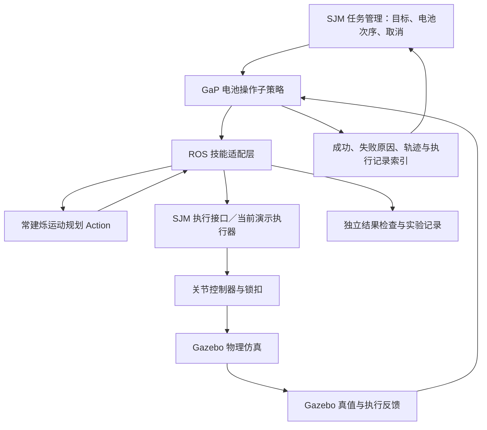

# GaP × S3：研究方案与接入建议

状态：**设计与源码核对完成，以下新增软件和实验尚未实现。** 日期：2026-09-05。工作分支：`feat/motion-planning-v2`。[通俗论文解读](READING_NOTES.md) · [原有规划接口](../../architecture/INTERFACES.md)。

建议研究题目：**在已知工位与完美状态输入下，用 GaP 自动生成和改进 AUBO S3 电池操作策略，并通过真实规划、控制和物理反馈验证可靠性与效率。**

## 1. 首先回答三个可测量的问题

| 问题 | 怎样得到有意义的结论 |
| --- | --- |
| 自动生成的图能否调用现有 S3 技能？ | 原场景完整抓放通过，轨迹数据不丢失，失败能正确返回 |
| 改图能否提高适应变化和恢复失败的能力？ | 在生成器未见过的有效场景中，对比固定流程、人工图与自动图 |
| 提升是否值得额外成本？ | 比较完整任务成功率、吞吐量、规划和生成时间、仿真与 API 成本 |

**更适合常建烁的深入方向**是“让技能图利用运动规划的结构化反馈”：无 IK、碰撞、力矩不足和抓取未连接，应触发不同的改进。研究它是否比统一的“失败了，请重试”反馈更有效。单纯把图画出来属于接线验证；自动生成并根据反馈改进图，才进入本文方法的主要研究内容。

## 2. 怎样保留已有成果并与 SJM 对接

原有 `main` 和 `v0.1.0-sim-demo` 保存提交 `8f204d6e8c3f85d5dc602ac1afd5f865761feffd`。本分支继续开发；原有最终视频、验收数据和技术报告作为历史基线保留。[基线验收](../../VALIDATION.md)

建议的正式接入关系：



这是接口建议，不改变现有团队分工。SJM 仍管理比赛级任务、取消和全局状态；GaP 在授予的一段操作内决定接近、抓取、搬运和恢复步骤。**同一时刻机械臂只有一个执行授权入口。** 初期研究可用 GaP 替代 `scripts/demo.py` 的测试编排，再把同一技能边界交给 SJM 对接。

现有 `/motion_planning/plan` 和 `/arm_controller/follow_joint_trajectory` 继续承担轨迹生成与执行。GaP 不需要重新实现多初值 IK、Ruckig、B 样条、FCL 或电机反馈控制。

## 3. 当前官方代码与论文存在的接口差异

本节核对官方引擎提交 [`93e929c9`](https://github.com/graph-robots/graph-as-policy/tree/93e929c9a1668cacba2e8be604e99a7538abbee9)，对应选定文件已归档。适配依据应固定到该提交，后续升级单独记录。

| 核对发现 | 对接做法 |
| --- | --- |
| 论文附录大量使用 `vos.builder`、gRPC/protobuf；当前代码是 `gap` 与 v3 工作流，核心数据类型已改为 TypedDict/numpy | 按当前 schema 和源码开发，论文示例用于理解意图 |
| GaP 的旋转约定为 `wxyz`；ROS 字段习惯为 `x,y,z,w` | 用具名字段转换；数组显式换序并检查归一化 |
| GaP OBB `extent` 是半尺寸 | 由 CAD 全尺寸计算半尺寸；位置、朝向和单位同时记录 |
| 相机 pose 表示 camera-to-world，深度单位 m | 后续视觉接入时核对 D435i 光学 TF 方向、深度编码与时间戳 |
| 当前 `Trajectory` 只有 `waypoints`，其中关节状态主要存 positions；默认执行路径提取关节点进行流式或逐点运动 | 自定义 ROS 技能保留完整 `RobotTrajectory`；不可用默认轨迹类型代替带时序的 ROS 轨迹 |
| 无依赖节点会并行执行，默认工作线程数为 8 | 初期设单工作线程；桥接层仍对机械臂和锁扣互斥，后期只开放无冲突的并行工作 |
| 同一 scope 中节点只完成一次；重复执行通过子图循环组织 | 恢复流程用受限子图循环；显式记录剩余次数，不假设存在通用 `max_retries` 字段 |
| 子图之间按输出名匹配，最新同名输出可能覆盖旧值 | 观测、目标和轨迹使用明确名称及版本；执行前检查状态仍匹配 |
| `gap.execute` 默认 `checkpoints="warn"`；检查需要 connector 提供 `world_snapshot` | 接入快照后显式使用 `checkpoints="raise"`，另外保留独立任务验收 |

几何与轨迹依据：[types.py](upstream/graph-as-policy/gap-core/src/gap_core/types.py) 和 [默认执行代码](upstream/graph-as-policy/gap/connector/core.py)。图调度依据：[Executor 文档](upstream/graph-as-policy/docs/source/reference/executor.md) 和 [v3 schema](upstream/graph-as-policy/docs/source/reference/workflow-schema.md)。检查模式依据：[execute.py](upstream/graph-as-policy/gap/runtime/execute.py) 和 [checkpoints 文档](upstream/graph-as-policy/docs/source/running/checkpoints.md)。

当前 facade 支持自定义 connector 的 `tool_registry`、`get_observation` 与可选 `world_snapshot`，提供了复用官方执行器的切入点。所核对的官方目录树和连接器文档没有给出可直接使用的 AUBO S3/Gazebo 适配器，不能按“安装后换 URDF 即可”估算工作量。[官方连接器说明](upstream/graph-as-policy/docs/source/real-robots/connectors.md)

## 4. 第一版需要哪些技能

下表名称是**拟定义的本项目 API**，不是已经存在的官方 GaP 接口。

| 拟定技能 | 输入 | 输出与通过条件 |
| --- | --- | --- |
| `observe_scene_gt` | 需要的对象 ID | 电池位姿、关节、锁扣、负载、场景版本与时间戳 |
| `compute_handle_goal` | 电池 CAD 变换、任务阶段、接近参数 | 带坐标系的 TCP 目标位姿；完整位置与朝向 |
| `plan_motion` | 当前状态、目标位姿、模式、接触对象、规划预算 | 成功标志、完整轨迹的引用、时长、碰撞/动力学诊断 |
| `execute_trajectory` | 轨迹引用、期望起点与场景/负载版本 | 控制器结果、跟踪记录、实际终点；完成后才允许依赖动作继续 |
| `close_latch_and_verify` | 电池 ID、期望抓取位姿 | 夹爪执行结果及真实连接对象；不能仅凭闭合指令判定抓住 |
| `release_and_verify` | 期望释放对象 | 已解除连接且锁扣打开；随后执行独立的向上撤离动作 |
| `check_placement` | 电池 ID、目标区域、固定判据 | 位置、姿态、稳定性和接触结果；不读取 Agent 自报的“成功” |

抬升、搬运、下降、上撤可以由“生成该阶段目标 → 规划 → 执行 → 检查”的子图组合完成。保留这个粒度，Agent 才能调整有物理意义的步骤；若只提供一个 `run_demo()` 大技能，可研究的空间会很小。

建议 ROS 网关保存原始 `RobotTrajectory`，图中传递 `plan_id` 和诊断摘要，避免大数组反复序列化。网关仍逐项保留 `joint_names`、positions、velocities、accelerations、effort、`time_from_start`。引用绑定起点、负载和场景版本；若状态变化使规划过期，应重新规划。关节按名字匹配。

失败结果至少区分：目标不可达、碰撞约束失败、动力学约束失败、状态过期、控制器拒绝/超时、锁扣未连接、放置未通过。ROS 失败必须转成执行器明确识别的错误或失败分支，检查 facade 返回的 `result.success`；不能把一个包含 `success:false` 的非空字典当成成功。

## 5. 自动修改什么，固定什么

第一轮允许生成器选择：合法的抓取朝向候选、接近/抬升高度、自由运动或笛卡尔接近、受限速度比例、重新观测与重规划步骤、有限重试。比赛给定的搬运次序是输入约束，图不应为缩短时间擅自改序。

初始姿态转换由 CAD 和 TF 明确计算；不能通过补偿错误坐标约定的“经验偏移”掩盖接口错误。几何目标和可调参数先有明确的单位、范围及物理意义。

实验期间固定独立验收程序、碰撞允许规则、速度/加速度/jerk 与力矩限值、锁扣捕获条件、物理参数和底图尺寸。Agent 只修改候选策略，不修改这些判据。碰撞、执行超限和错误连接都会令该次任务失败，不能通过提高速度奖励抵消。

策略优化优先级建议为：**先满足物理可行性 → 提高完整任务成功率 → 在同等可靠性下提高吞吐量 → 控制生成与试验成本。** 这比把所有指标随意加权更便于解释研究结论。最终以实际执行结果判断，规划器预测只是中间证据。

## 6. 按五个阶段推进

| 阶段 | 具体交付 | 验收与下一步条件 |
| --- | --- | --- |
| P0 接线 | 隔离环境、固定官方版本、S3 技能适配器、人工最小图、统一记录 | C→T0 与 CAB 能完成；注入一次规划失败可正确终止；完整轨迹字段与控制跟踪不退化 |
| P1 生成 | 从任务描述、技能目录和约束生成 v3 图；静态验证与版本记录 | 原场景运行通过；保存真实模型输出、提示词、图、模型版本和生成成本 |
| P2 排练 | 在训练场景执行，生成结构化反馈，修改参数/边/子图并保存每轮差异 | 能展示可复查的失败原因和修正；通过验证集选图，测试集在此期间封存 |
| P3 对照 | 冻结候选图，在留出场景运行所有对照组 | 报告完整任务成功率、失败类别、吞吐量、时间与成本；如无提升也如实保留 |
| P4 视觉扩展 | 用 D435i 感知/标定输出替换控制输入中的真值；真值仅供验收 | 单独评价感知误差及恢复能力，避免与前面的真值结果混合 |

P0 是功能验证，不应称为已经复现完整 GaP。P1/P2 使用真实的生成与反馈过程；手写图或预先写好的“改进结果”需要分别标识。

P1 需要选定模型服务和试验预算；当前论文阶段尚不依赖这些信息，也没有发起收费模型请求。模型、提示词、温度、版本与调用开销需要随实验归档。P0 可以先独立完成。

## 7. 场景与对照怎样设计

原始比赛世界维持其尺寸和布局，另设 `research_scenarios` 保存明确标注的扰动配置。先从小幅电池平移/偏航开始，逐步增加变化；**具体幅度先经过 CAD 碰撞与工作空间检查再确定**。原场景电池间距有限，不能照搬论文 20×20 cm 的物体扰动范围，也不能让独立随机偏移生成相互穿透的电池。

生成场景时检查物体不重叠、在桌面上且满足预先定义的任务范围。排除非法初始场景的规则在测试前固定，不能运行失败后再删除它。目标口令变化必须满足比赛允许的任务约束。

以不同、固定的场景种子分训练、验证与测试；测试实例及其失败反馈不回流给改图 Agent。同一比较使用相同初始场景与资源预算。规划中的时间预算和数值库可能产生额外运行差异，应记录环境并在有差异时重复测量。

真值场景先评估几何变化；控制器超时、锁扣拒绝等故障注入另列为恢复测试，不能混进正常工况却只报一个成功率。真值已知也不能使任意物理失败都可恢复，例如物体落出可达空间时应报告失败。

| 对照 | 目的 |
| --- | --- |
| B0 原版 `demo.py` | 固定版本回归，确认现有系统没有被接入改动破坏 |
| B1 人工设计图，使用相同技能与允许的恢复动作 | 检查自动方法能否接近或超过人工方案，同时记录人工编写成本 |
| B2 一次生成、无排练 | 分离“生成技能图”的作用 |
| B3 固定图，只优化参数 | 检验改进是否仅靠调整高度、速度等参数就能取得 |
| B4 生成 + 结构化反馈 + 改图 | 检验完整方法是否在同样试验预算下更有效 |

P0 用与原流程等价的小图验证接口；正式 B1 可以加入人工明确编写的恢复规则，但应在查看测试结果前冻结。各组共享感知输入、技能能力、规划器、控制器、物理参数和判据。B3/B4 使用相同的排练预算，B2 与 B4 还应报告多个独立生成结果，避免只挑选最好的一张图。

可增加一项运动规划相关消融：B4 的结构化规划反馈与同预算的通用文字失败反馈比较。它能帮助判断你的核心贡献是否来自对几何、可行性和执行约束的利用。

## 8. 衡量“快”与“可靠”

完整任务成功率以“全部要求完成”的任务次数为分母；同时保留单电池成功率。CAB 中成功两块、失败一块时，物体级是 2/3，完整任务级是失败。未生成合法图、执行超时和重试耗尽也要记录。

吞吐量按预先定义的单位统计，例如：

```text
完整任务吞吐量 = 3600 × 完整成功任务数 / 所有尝试的总耗时（秒）
```

分母包含失败、等待和恢复；仿真时间与墙钟时间分别计算、分别标注。若试验每次重置，记录是否计入重置成本；初期建议同时保留含重置的试验墙钟与不含重置的机器人任务时间。

每次运行记录：完整/单电池结果、失败技能与原因、恢复次数、非预期接触、约束超限、最小间距、峰值跟踪误差、放置稳定性，以及下列不同时间。

| 时间 | 用途 |
| --- | --- |
| 图生成与排练的总墙钟时间、模型 token/API 成本 | 衡量开发和自动调参代价 |
| 单次规划计算墙钟时间 | 判断求解器计算开销 |
| 纯机械臂运动仿真时间 | 判断连续轨迹效率 |
| 完整任务仿真时间 | 包含锁扣、等待与恢复的操作效率 |
| 单次试验实际墙钟时间 | 判断本机研究吞吐与可复现成本 |

原版 CAB 实测为 19.3153 s 纯运动、37.544 s 完整仿真流程、22.6709 s 累计规划墙钟、409.406 s 运行墙钟。这是**一个序列实例**，基础和序列总共四次抓放，不能据此估计高置信度成功率，也不能把它与论文不同机器人上的 67 s 直接比较。[基线记录](../../VALIDATION.md)

先跑少量冒烟场景确认记录正确，再扩大留出测试。若按原版约 409 s/次粗略外推，100 次约需 11.4 小时，还没乘以对照组数；这只是预算估算，接入后要重新测量。成功率报告次数和置信区间，耗时报告中位数及尾部情况；小样本只作为初步证据。

## 9. 本机与依赖方案

当前 `/opt/ros` 中为 **Humble**，现有演示采用 Gazebo Harmonic；GPU 为 **RTX 5060 Laptop，8151 MiB 显存**。官方 README 给全栈 quickstart 的要求是 RTX 4090 级、至少 24 GB；安装文档另说明单独 LIBERO quickstart 约用 10 GB。[官方 README](upstream/graph-as-policy/README.md) · [安装说明](upstream/graph-as-policy/docs/source/getting-started/installation.md)

这意味着先采用“**GaP 图执行/生成能力 + ROS 技能 + 已有 Gazebo 真值**”比较合适。图编排本身不等同于加载全部感知和 VLA 模型，不能据全栈要求判断本机无法做 GaP 研究。

同时，当前官方 `pyproject.toml` 的基础依赖已含 cuRobo、Torch、MuJoCo 和 LIBERO，并非默认轻量安装。建议独立 checkout 与 Python 环境，核对最小运行依赖和导入路径，通过进程接口连接已有 ROS 环境；不在当前 ROS 环境直接执行全栈 `uv sync`。[实际依赖清单](upstream/graph-as-policy/pyproject.toml)

优先复用官方执行器和 schema，通过自定义 connector/工具注册接入 S3。若最小依赖适配需要补丁，保存补丁与固定版本；若最终只能先实现兼容子集，应命名为 GaP-inspired 原型并说明差异，不宣称完成作者全栈复现。

## 10. 后续代码与实验文件放哪里

下面是**下一阶段拟新增的结构**，当前没有用空节点占位。

```text
src/mtc_gap_bridge/                 ROS 技能、轨迹引用、失败映射、取消与快照
research/gap/skills/                S3 技能声明及输入输出契约
research/gap/graphs/manual/         人工图与回归基线
research/gap/graphs/generated/      模型实际生成的图及版本
research/gap/prompts/               生成与反馈模板、可修改范围
research/gap/experiments/           有效场景、数据划分、对照配置、固定验收
research/gap/environment/           依赖锁定、上游版本与适配补丁
data/gap_runs/<experiment>/<trial>/ 场景、图、轨迹、反馈、耗时与视频索引
docs/research/gap/                  论文、笔记与阶段结论
```

每轮实验关联 `scene_id / graph_hash / planner_commit / trial_id`，保留原始失败记录。大视频、批量运行数据与模型权重采用单独的数据归档规则；Git 保留配置、源码、摘要和选定演示，避免覆盖原版已验收记录。

下一次具体开发建议从 **P0：单电池抓放图与 ROS 技能适配器** 开始。先证明接口和物理执行可靠，再用同一个测试框架研究自动生成、改图和泛化。
